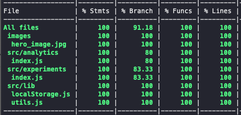

# PROOF OF CONCEPT A/B TESTING

## Scripts
In the project directory, you can run:

- `npm run start` - Runs the application
- `npm run build` - Build a dist directory
- `npm run test` - Execute all the test

## Live

The application is deployed -> [https://abtest.surge.sh/](https://abtest.surge.sh/)

## Description

The idea of this project is to create a vanilla javascript A/B testing motor. Usually, when we have to do this kind of task, we tend to use an external library. 

The main point to me was to keep as simple as possible the starter point of my application, the index.js file. In this file, we execute the Experiments and Analytics libraries. 

First of all, it is a requirement to initialize experiments to get the variations needed for the website user. Once we have the variants stored in the localSTorage, we can initialize the Analytics class. This class will allow us to track any event we define and every page view we set.

For this first version of the project, we take for granted that the user has accepted all the GDPR. We could improve the Analytics class to handle all the legal consent using this library.

The experiments.json shows an idea of how a server could give the data. This structure allows us to handle more than one experiment per page. Also, the variants are objects to allow scalability for it. For example, we could add more information about traffic, valid date, or others in the future.

## LocalStorage

As this is a client-side proof of concept, we ideally think that the localStorage is a good starting point for the persistent data. Thus, we achieve that the user only sees one variation, and also, we can handle how many times we track an event. But in the future will be an improvement to use the cookies to send this information easily to a server. 

## Testing

Jest was the tool selected to test this application. This library allows us to test quickly. Also, Jsdom makes it easy to test the interaction with the DOM.

- `npx jest --coverage` - to get the coverage

## User stories

1. A visitor sees only one variation (assigned randomly) when lands on the page. ✔
2. The assigned variation doesn’t change after page reload. ✔
3. Track a pageview when a visitor lands on the page. ✔
4. Track an event when a visitor clicks on the “Sign up” button. Printing payload to the console would do. ✔
5. Make sure we don’t count the same visitors and clicks twice. ✔
6. Allow editors to run multiple AB-tests on the same article. For example, one AB-test will test a hero image and another AB-test will test the outro copy. ✔ 
